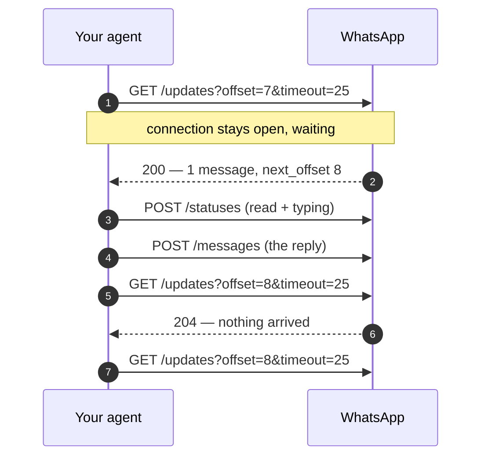

# How it works

Six things about the platform that shape every agent you will write. None of them are hard; all of them will bite you if you assume otherwise.

## Your agent has one conversation

An agent lives in your WhatsApp chat list as a contact, and it can only exchange messages with **the account that created it**. Not other people, not your other agents, not groups.

That makes the mental model small: there is no routing, no session per user, no address book. There is one thread, and your code decides what to say in it. If you try to send anywhere else you get a 403 (code `131005`), or a 400 (code `131009`) if the recipient is not a WhatsApp user at all — another agent included.

## It polls; nothing calls you

There is no webhook. Your agent opens a request and **holds it open** until a message arrives or the timeout runs out — up to 25 seconds — then opens another.



Two consequences worth having in mind:

* **You need no server, domain or public address.** Only outbound HTTPS. A laptop or a small container is enough.
* **One poller per agent.** Start a second and the first dies with `PollReplacedError` (409). This is the single most common way to break a working agent.

## Updates are a numbered list you read with a pointer

Messages and delivery receipts go into one numbered sequence per agent. Each response tells you the number to ask for next:

```python
update = client.get_updates(offset=7)
update.next_offset          # 8 — pass this to the next call
```

Three properties follow, and together they are the whole subtlety of receiving:

**Reading does not consume — marking read does.** Polling leaves entries in place for 30 days, so the same offset can be read again. But once a message is marked read it drops out of the buffer, and a replay no longer returns it; receipts for your own messages stay. So a replay brings back only what was never marked read.

**An empty poll gives you nothing to advance with.** When the timeout passes with no traffic you get a 204 and *no* `next_offset` — so you re-poll with the same number. `get_updates()` returns `None` there, and `poll_updates()` just keeps going.

**Where you are is your business.** The platform does not track what you have handled; your stored offset does. Persist it and a restart resumes cleanly:

```python
from whagent import Agent, FileOffsetStore

agent = Agent(token, offset_store=FileOffsetStore(".whagent-offset"))
```

[The full picture →](receiving.md)

## Identifiers name accounts, and accounts change

Every participant is written as `user:<id>` or `agent:<id>`. Treat the whole string as opaque: never parse it, never show it to a person, and never store it as a permanent key.

It can change — a new phone number, or an account deleted and registered again. So the safe habit is always the same: **take the identifier off an inbound message and send it straight back.**

```python
@agent.on_text
def handle(ctx):
    ctx.reply("on it")           # goes back to ctx.sender, always current
```

The prefix earns its keep in one place: `context.from`, which tells you whether a quoted message was written by you (`user:`) or by your agent (`agent:`).

## Every message has an id

Inbound or outbound, each message carries a **wamid**. You will use it for four things:

| To do this | Use |
|---|---|
| Quote a message in your reply | `reply_to=message.id` |
| Mark a message as read | `client.mark_read(message.id)` |
| Match a delivery receipt to what you sent | `status.id` |
| Avoid answering the same message twice | `message.id` as a key |

## Media travels separately

You never attach bytes to a message. Sending is upload → get an id → send a message referencing it; receiving is the reverse. Everything expires after 30 days.

```python
media_id = client.upload_media("invoice.pdf")     # step 1
client.send_document(to, media_id=media_id)       # step 2

# one call that does both
client.send_document(to, file="invoice.pdf")
```

[Files and media →](media.md)

## What the platform does, and what you do

| The platform | You |
|---|---|
| Buffers updates for 30 days | Remember which offset you reached |
| Assigns every message an id | Remember which ids you answered |
| Enforces rate limits and size caps | Stay inside them, or let the library pace you |
| Tells you a message was read | Decide what "handled" means |

The library covers the right-hand column for the common cases — offset tracking, deduplication within a process, pacing, retries — and gets out of the way for the rest.
