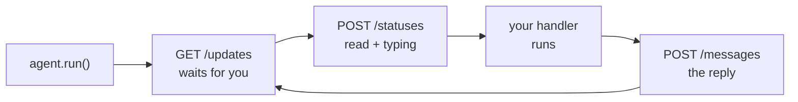

# Getting started

From nothing to an agent that answers you in WhatsApp. About five minutes.

## 1. Create the agent

In WhatsApp on your phone:

1. **Settings → Agents → Create an agent**
2. Give it a display name and an avatar
3. Open the agent's chat → **Chat info → API key**
4. Copy the key

That key is your API token. It identifies the agent and grants full control of it, so treat it like a password: keep it out of source control, and pass it through the environment.

```bash
export WHATSAPP_AGENT_TOKEN='...'
```

!!! warning "Two ways to lose the token"
    Rotating it invalidates the old one, and reinstalling WhatsApp means generating a new one. A token that is present but no longer valid produces a **400 with code 100** — which looks like a bad request, not an auth problem. If working code suddenly fails that way, check the token first.

## 2. Install the library

```bash
git clone https://github.com/Elimeshi1/Whagent.git
cd Whagent
pip install -e .
```

Python 3.9 or newer. The only runtime dependency is [`requests`](https://pypi.org/project/requests/).

## 3. Write the agent

Save this as `mybot.py`:

```python
import os

from whagent import Agent, FileOffsetStore

agent = Agent(
    os.environ["WHATSAPP_AGENT_TOKEN"],
    # Remember where we stopped, so a restart does not skip messages.
    offset_store=FileOffsetStore(".whagent-offset"),
)


@agent.on_text(r"^/start")
def start(ctx):
    ctx.reply(f"Hi {ctx.profile_name or 'there'} — send me anything.")


@agent.on_text
def echo(ctx):
    if ctx.text.startswith("/"):
        return                       # handled above
    ctx.reply(f"You said: {ctx.text}")


@agent.on_media
def describe(ctx):
    ctx.reply(f"That is a {ctx.type} ({ctx.message.media.mime_type}).")


if __name__ == "__main__":
    agent.run()
```

## 4. Run it

```bash
python mybot.py
```

Now write to the agent in WhatsApp. You should see the message go blue-ticked, a *typing…* indicator, then the reply. All of that is `run()`: it polls for updates, marks each message read, shows the indicator while your function runs, and dispatches to whichever handlers match.

Stop it with ++ctrl+c++.

## What just happened



Every handler receives a `ctx` — the message, plus everything you need to answer it:

```python
@agent.on_text
def handle(ctx):
    ctx.text            # what they wrote
    ctx.sender          # who wrote it (send it back unchanged)
    ctx.profile_name    # their display name, when there is one
    ctx.reply("...")            # answer with text
    ctx.reply("...", quote=True)  # answer quoting their message
    ctx.reply_image(file="chart.png", caption="here")
    ctx.download("/tmp/file")     # save media they sent
```

## Send something without the loop

If you only want to push a message — from a cron job, a script, anywhere — skip the `Agent` layer:

```python
from whagent import Client

with Client(os.environ["WHATSAPP_AGENT_TOKEN"]) as client:
    result = client.send_text("Deploy finished ✅")
    print(result.message_id)
```

You never name the recipient: an agent has exactly one, and the client finds it by itself before the first send. Don't hardcode an identifier — [it can change](faq.md).

## Next

- [How it works](concepts.md) — polling, offsets, ids: the model in six short pieces
- [Questions and answers](faq.md) — who it can message, what happens offline, running two agents
- [Sending messages](sending.md) — every message type, captions, quotes, previews
- [Recipes](recipes.md) — persistence, slow work, threads, running it as a service
